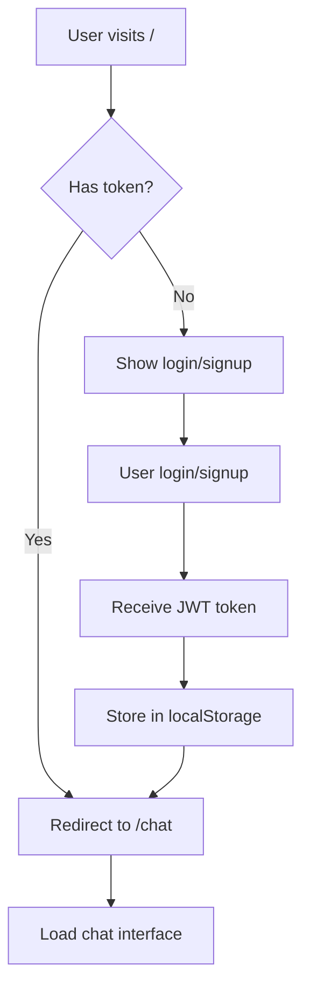
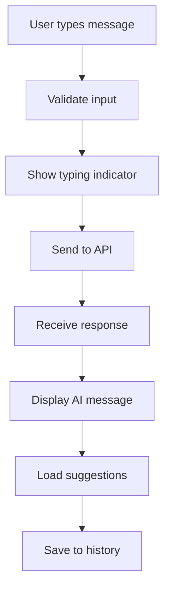

# 🎨 Frontend TRAVELLO - Login & Chat Interface

## Overview
Frontend modern untuk TRAVELLO chatbot dengan fitur lengkap authentication dan chat interface yang user-friendly.

## ✨ Features

### 🔐 Authentication System
- **Modern Login/Signup** dengan glass morphism design
- **Google OAuth Integration** untuk login cepat
- **Form Validation** real-time dengan user feedback
- **Password Visibility Toggle** untuk user experience
- **Remember Me** functionality
- **Session Management** dengan JWT tokens

### 💬 Chat Interface
- **Real-time Chat** dengan typing indicators
- **Smart Suggestions** berdasarkan chat history
- **Message History** dengan modal view
- **Auto-resize Textarea** untuk comfort
- **Character Counter** (max 1000 chars)
- **Keyboard Shortcuts** (Enter to send, Shift+Enter for new line)
- **Responsive Design** untuk mobile dan desktop

### 🎯 User Experience
- **Smooth Animations** dengan fade-in dan slide-in effects
- **Loading States** dengan spinners
- **Error Handling** yang user-friendly
- **Auto-scroll** ke pesan terbaru
- **Context Menu** untuk user actions
- **Status Indicators** untuk connection state

## 📁 File Structure

```
public/
├── auth.html          # Login & Signup page
├── chat.html          # Main chat interface
└── (assets served from CDN)

src/
├── app.ts            # Express server dengan static file serving
├── routes/
│   ├── improved-chat.routes.ts  # Chat API endpoints
│   ├── auth.routes.ts          # Auth API endpoints
│   └── google-auth.routes.ts  # Google OAuth endpoints
└── controllers/
    ├── improved-chat.controller.ts  # Chat logic
    └── auth.controller.ts         # Auth logic
```

## 🚀 Quick Start

### 1. Start Backend Server
```bash
npm start
```

### 2. Access Frontend
- **Login Page:** http://localhost:5000/
- **Chat Page:** http://localhost:5000/chat
- **API Health:** http://localhost:5000/health

### 3. Test Authentication
1. Buka http://localhost:5000/
2. Sign up dengan email baru
3. Login dengan credentials
4. Atau gunakan "Login with Google"

## 🎨 Design System

### Color Palette
- **Primary:** #667eea (Blue gradient)
- **Secondary:** #764ba2 (Purple gradient)
- **Success:** #10b981 (Green)
- **Error:** #ef4444 (Red)
- **Warning:** #f59e0b (Amber)
- **Neutral:** #6b7280 (Gray)

### Typography
- **Headings:** Bold, 2xl untuk titles
- **Body:** Regular, base untuk content
- **Small:** Text-sm untuk metadata
- **Micro:** Text-xs untuk timestamps

### Components
- **Buttons:** Gradient background dengan hover effects
- **Inputs:** Border radius dengan focus states
- **Cards:** Glass morphism effect
- **Modals:** Backdrop blur dengan shadows

## 🔧 Technical Implementation

### Authentication Flow


### Chat Flow


### State Management
- **localStorage:** Token dan user data
- **sessionStorage:** Temporary chat state
- **DOM State:** Current messages dan UI state

## 📱 Responsive Design

### Mobile (< 768px)
- **Full-width** chat bubbles
- **Bottom sheet** untuk user menu
- **Compact** input area
- **Touch-friendly** buttons

### Tablet (768px - 1024px)
- **70% max-width** chat bubbles
- **Sidebar** user menu
- **Balanced** spacing

### Desktop (> 1024px)
- **Optimal** reading width
- **Hover states** untuk interactions
- **Keyboard shortcuts** support

## 🎯 User Interactions

### Login/Signup Form
- **Real-time validation** dengan visual feedback
- **Password strength** indicator
- **Email format** validation
- **Loading states** dengan disabled buttons
- **Success/error** messages dengan auto-dismiss

### Chat Interface
- **Enter key** untuk send message
- **Shift+Enter** untuk new line
- **Click suggestions** untuk quick input
- **Clear chat** dengan confirmation
- **View history** dalam modal
- **User menu** dengan profile info

### Google OAuth
- **Popup window** untuk Google login
- **Callback handling** dengan URL parameters
- **Auto-redirect** setelah success
- **Error handling** untuk denied access

## 🔐 Security Features

### Client-side
- **XSS Protection** dengan text sanitization
- **CSRF Protection** dengan same-site cookies
- **Input Validation** sebelum API calls
- **Secure Storage** untuk tokens

### Server Integration
- **JWT Authentication** untuk API calls
- **CORS Configuration** untuk cross-origin
- **Rate Limiting** untuk API protection
- **Session Management** dengan secure cookies

## 🚨 Error Handling

### Network Errors
- **Connection failed** dengan retry option
- **Timeout handling** dengan user feedback
- **API errors** dengan specific messages
- **Offline detection** dengan fallback UI

### Validation Errors
- **Empty input** validation
- **Character limit** enforcement
- **Email format** checking
- **Password strength** requirements

## 📊 Performance Optimization

### Loading States
- **Skeleton screens** untuk initial load
- **Progressive loading** untuk chat history
- **Lazy loading** untuk suggestions
- **Optimistic updates** untuk better UX

### Caching Strategy
- **Local storage** untuk user data
- **Session storage** untuk temporary state
- **Memory caching** untuk frequent data
- **Service worker** untuk offline support

## 🎨 Customization

### Theme Configuration
```javascript
// Di auth.html dan chat.html
const theme = {
    primary: '#667eea',
    secondary: '#764ba2',
    success: '#10b981',
    error: '#ef4444',
    warning: '#f59e0b'
};
```

### API Configuration
```javascript
// Di kedua file HTML
const API_BASE = 'http://localhost:5000/api';
const CORS_ORIGIN = 'http://localhost:5000';
```

## 🔄 Browser Support

### Supported Browsers
- ✅ Chrome 90+
- ✅ Firefox 88+
- ✅ Safari 14+
- ✅ Edge 90+
- ⚠️ IE 11 (limited support)

### Required Features
- **ES6 Modules** untuk modern JavaScript
- **CSS Grid** untuk layout
- **Flexbox** untuk responsive design
- **Local Storage** untuk data persistence
- **Fetch API** untuk HTTP requests

## 📱 Mobile Features

### Touch Interactions
- **Swipe gestures** untuk navigation
- **Long press** untuk context menu
- **Pull to refresh** untuk chat history
- **Virtual keyboard** optimization

### Performance
- **Reduced motion** untuk accessibility
- **Touch-friendly** button sizes
- **Optimized scrolling** untuk smooth experience
- **Battery efficient** animations

## 🔧 Development

### Local Development
```bash
# Start backend server
npm start

# Frontend served from /public
# Access at http://localhost:5000
```

### Debug Mode
```javascript
// Enable debug logging
localStorage.setItem('debug', 'true');

// View current state
console.log('Token:', localStorage.getItem('token'));
console.log('User:', JSON.parse(localStorage.getItem('user')));
```

## 🚀 Production Deployment

### Build Process
```bash
# Build TypeScript
npm run build

# Start production server
npm start
```

### Environment Variables
```env
NODE_ENV=production
PORT=5000
CORS_ORIGIN=https://yourdomain.com
JWT_SECRET=your-production-secret
GEMINI_API_KEY=your-gemini-key
```

---

## 🎉 Ready to Use!

Frontend TRAVELLO sekarang memiliki:
✅ Modern authentication system  
✅ Real-time chat interface  
✅ Google OAuth integration  
✅ Responsive design  
✅ Error handling  
✅ Performance optimization  
✅ Security features  

**Akses aplikasi:** http://localhost:5000 🚀
